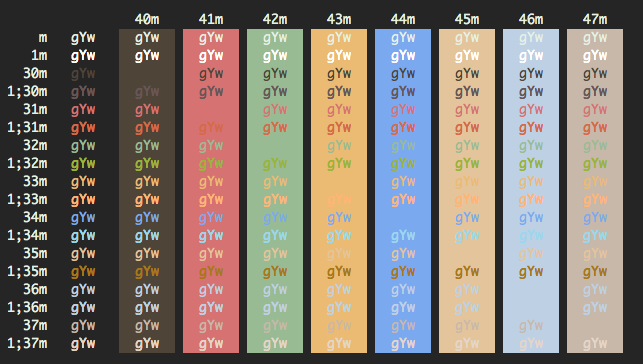

# Announcement 1/1/2026

I will no longer be maintaining my dotfiles here on github; you can see what I
was doing in the branch `TheBigClean2025`, but you can follow along with future
updates at
[https://tildegit.org/kirch/dotfiles](https://tildegit.org/kirch/dotfiles) I
wish there was some grand statement to be made about the end of this era; but
none of the below text has been completely right in a long time, I started this
repo to keep dotfiles on a work Mac in sync with my home PC, originally the
files were copied over sneakernet -- I remember installing Ubuntu on a Pentium
III around this time in 2012, and having to install dependencies over said
sneakernet because I couldn't afford home internet; and look at me now! with an
Internet bill of my own!

Anyhow, this is getting archived; find the new hotness on tildegit going forward.

We now return you to your regularly scheduled, old README.md:

#My dotfiles

1. clone into home
1. run ~/dotfiles/make.sh
1. ???
1. profit

For the moment I'm primarily working on Ubuntu, with

* [vim](http://www.vim.org)
* [tmux](http://tmux.sourceforge.net/)
* [bash](http://www.gnu.org/software/bash/bash.html)

but when I'm using OSX I also like to use
* [slate](https://github.com/jigish/slate)
* [iTerm2](http://iterm2.com/)

Here's how my terminal looks after running 'work'

DISCLAIMER: My [vimrc](vimrc) (and everything else) is setup the way I like it, for now, and will likely change whenever I feel like it. Use it at the risk of **Pandajail** where pandas are sent when you use someone else's `vimrc`. Don't be the vimmer responsible for this:

colophon:

The [Arthur Colorscheme](colors) was created by [Baskerville](https://baskerville.github.io/), and liberated from [iterm2-color-schemes](https://github.com/mbadolato/iTerm2-Color-Schemes)

Preferred font is [Fira Code](https://github.com/tonsky/FiraCode), a monospaced font with programming ligatures
